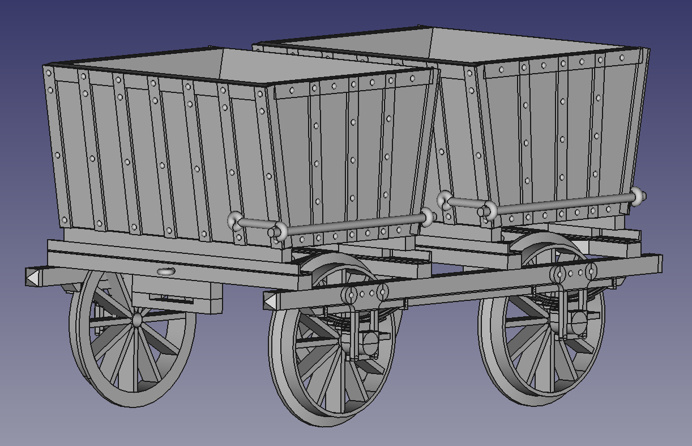
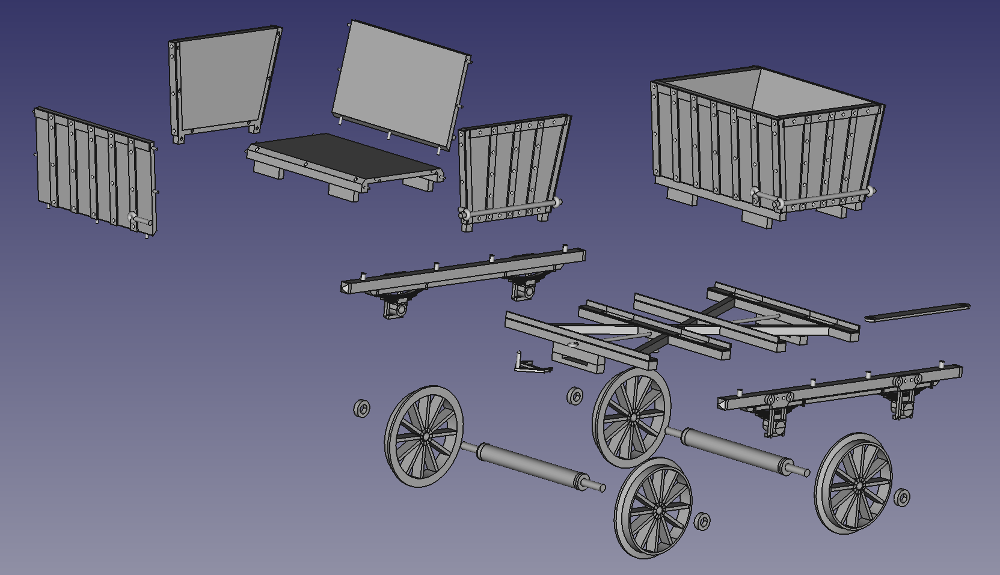

# Rocket-coal-wagon

# Rocket-coal-wagon
This respository contains the STL files to 3D print and construct a 1:16 scale, 3.5" gauge railway wagon.  The wagon is based on an 1830's dual hopper coal wagon and is designed to work with the Hornby Stephenson's Rocket live steam model.

# Parts included

The following parts are included in the STL files directory:
<UL>

<LI>Coal wagon Lower Frame (1 required)
<LI>Coal wagon Upper Frame (2 required)
<LI>Coal wagon axle (2 required)
<LI>Coal wagon axle washer (4 required)
<LI>Coal wagon wheel (4 required)
<LI>Coal wagon draw pin (1 required)
<LI>Coal wagon draw pin (1 required)
<LI>Hopper Base (2 required)
<LI>Hopper Front (2 required)
<LI>Hopper Rear (2 required)
<LI>Hopper Left Side (2 required)
<LI>Hopper Right Side (2 required)

</UL>
NB: You will require one self-tapping screw to secure the draw bar under the floor of the wagon, and glue to secure the pieces together (not supplied).
  
Here is an exploded view of the parts:
  

# Construction

1. Print all required parts

2. Join one lower frame to the under side of the upper frame (glue as needed). NB: Ensure the axle holes are inner-most

3. Place the assembled pieces down with the lower frame facing down (ready to receive the axles)

4. Assemble the axles and wheels (note washers are included that should go on narrow axle on the outside of the wheel) you will need two sets of axles with wheels

5. Place an assembled axles with wheels and washers with the short axle fitting into hole in the axle box on the long side of the pre-assembled pieces above.  DO NOT GLUE - these need to move freely (if being used as a running model)

6. Repeat with the second axle.

7. Join the second lower frame to the under side of the upper frame, ensuring that the axles slot into the axle boxes and remain free-wheeling (the tabs that fit into upper frame maybe glued as needed)

9. Slide the draw pin piece in the slot under the floor level on one of the short sides by gently inserting the two retaining clips, ensuring they don't break off.  NB: The 'pin' should be pointing upward.

10. Attach the draw bar to the other end of the wagon.  Slide the long thin end into the slot under the floor level on the short side opposite the one you just inserted the draw clip into.  Draw in under the floow carefully until the scren hole on the draw bar lines up with the post in the middle under the floor.  Secure with an approprate self-tapping screw.  Ensure the screw remains loose enough for the draw bar to swing side to side. Do not use any glue in this area.

11. Next assemble each of the two hoppers:

12. Attach the left and right hopper sides to the hopper base (glue as needed)

13. Attach the front and rear hopper sides to the hopper (glue as needed)

14. Repeat for the second hopper

15. Place each of the hoppers onto the wagon upper frame, so that the hopper legs fit into the slots on the upper frame channel (these do not need to be glued and can be removed, swapped, etc as needed)

12. Your wagon should now be complete, paint and decorate to your liking.

13. Well done!

## License

This project is licensed under the MIT License - see the LICENSE file for details.

## Author

Justin Dunlop (Zero1Guy)
